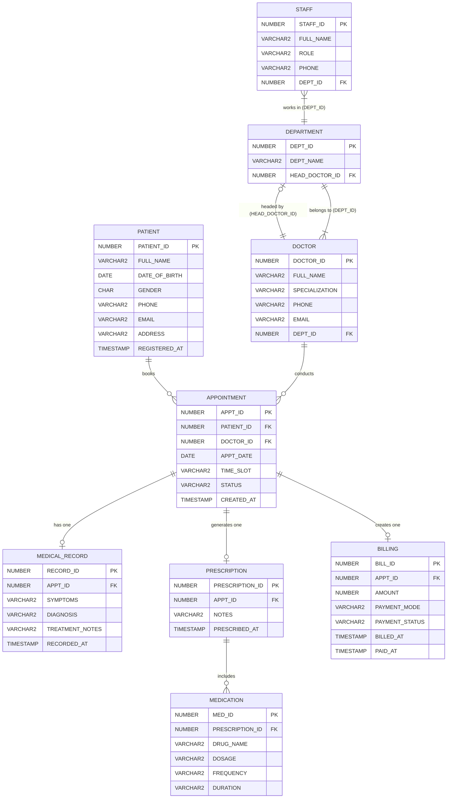

This schema visualizes all active database tables and their relationships within the Clinic Management System based on `database/schema.sql`.

```mermaid
erDiagram
    PATIENT {
        NUMBER PATIENT_ID PK
        VARCHAR2 FULL_NAME
        DATE DATE_OF_BIRTH
        CHAR GENDER
        VARCHAR2 PHONE
        VARCHAR2 EMAIL
        VARCHAR2 ADDRESS
        TIMESTAMP REGISTERED_AT
    }
    DEPARTMENT {
        NUMBER DEPT_ID PK
        VARCHAR2 DEPT_NAME
        NUMBER HEAD_DOCTOR_ID FK
    }
    DOCTOR {
        NUMBER DOCTOR_ID PK
        VARCHAR2 FULL_NAME
        VARCHAR2 SPECIALIZATION
        VARCHAR2 PHONE
        VARCHAR2 EMAIL
        NUMBER DEPT_ID FK
    }
    STAFF {
        NUMBER STAFF_ID PK
        VARCHAR2 FULL_NAME
        VARCHAR2 ROLE
        VARCHAR2 PHONE
        NUMBER DEPT_ID FK
    }
    APPOINTMENT {
        NUMBER APPT_ID PK
        NUMBER PATIENT_ID FK
        NUMBER DOCTOR_ID FK
        DATE APPT_DATE
        VARCHAR2 TIME_SLOT
        VARCHAR2 STATUS
        TIMESTAMP CREATED_AT
    }
    MEDICAL_RECORD {
        NUMBER RECORD_ID PK
        NUMBER APPT_ID FK
        VARCHAR2 SYMPTOMS
        VARCHAR2 DIAGNOSIS
        VARCHAR2 TREATMENT_NOTES
        TIMESTAMP RECORDED_AT
    }
    PRESCRIPTION {
        NUMBER PRESCRIPTION_ID PK
        NUMBER APPT_ID FK
        VARCHAR2 NOTES
        TIMESTAMP PRESCRIBED_AT
    }
    MEDICATION {
        NUMBER MED_ID PK
        NUMBER PRESCRIPTION_ID FK
        VARCHAR2 DRUG_NAME
        VARCHAR2 DOSAGE
        VARCHAR2 FREQUENCY
        VARCHAR2 DURATION
    }
    BILLING {
        NUMBER BILL_ID PK
        NUMBER APPT_ID FK
        NUMBER AMOUNT
        VARCHAR2 PAYMENT_MODE
        VARCHAR2 PAYMENT_STATUS
        TIMESTAMP BILLED_AT
        TIMESTAMP PAID_AT
    }

    DEPARTMENT |o--|| DOCTOR : "headed by (HEAD_DOCTOR_ID)"
    DOCTOR }|--|| DEPARTMENT : "belongs to (DEPT_ID)"
    STAFF }|--|| DEPARTMENT : "works in (DEPT_ID)"
    PATIENT ||--o{ APPOINTMENT : "books"
    DOCTOR ||--o{ APPOINTMENT : "conducts"
    APPOINTMENT ||--o| MEDICAL_RECORD : "has one"
    APPOINTMENT ||--o| PRESCRIPTION : "generates one"
    APPOINTMENT ||--o| BILLING : "creates one"
    PRESCRIPTION ||--o{ MEDICATION : "includes"
```
